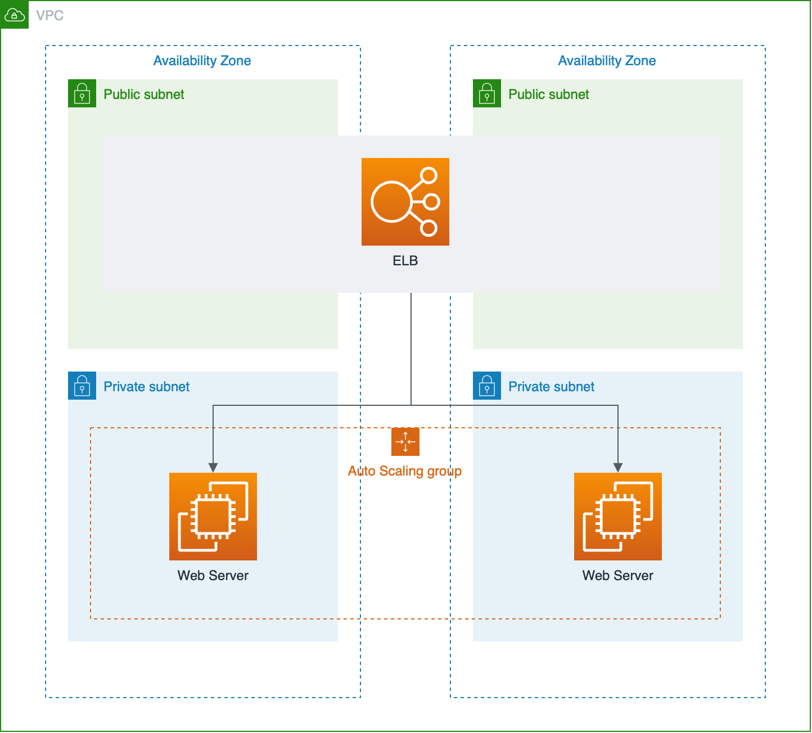

<!--
Copyright Amazon.com, Inc. or its affiliates. All Rights Reserved.

SPDX-License-Identifier: MIT-0
-->

# Terraform Sample Workshop

This repository contains hands on content that will guide you through building a simple Web Server stack using terraform in many ways, learn how to code infraestructure with terraform from a simple snippet to a modularized approach

# Prerequisites

- [Terraform v0.14 or above](https://www.terraform.io/downloads.html)
- AWS account

**THIS WORKSHOP WAS TESTED IN US-EAST-1 REGION**

# Overview of Workshop Labs

[Module 1](./module_1) - This module is responsible to teach you the basics of Terraform and how to code a simple architecture using Terraform resources.

[Module 2](./module_2) - This module is responsible to teach you how to create modules in terraform and use them, you will learn how to create re-usable Terraform resources to improve agility when coding infraestructure.

[Module 3](./module_3) - This module is responsible to teach you how to create another layer of Terraform abstraction using module in module, so you can create patterns and deliver the infraestructre in a much fast and simple way.

# Stack that will be deployed

 

So the above stack will be deployed in all the 3 modules of this workshop, but in each module we are going to improve our terraform using best practices.

## Start the workshop

[Click Here to start the first module](./module_1)