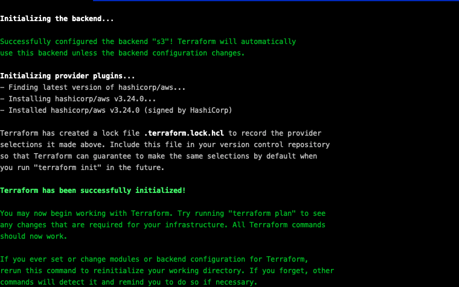

# Terraform Sample Workshop Module 1

In this module you will learn what is Terraform and also learn the basic of how to code a sample **.tf** file to create a stack, it will teach you the basics of Terraform and how to code a simple architecture using Terraform resources.

# What is Terraform?

[Terraform](https://www.terraform.io/) is an open-source infrastructure as code software tool that provides a consistent CLI workflow to manage hundreds of cloud services. Terraform codifies cloud APIs into declarative configuration files.

Write infrastructure as code using declarative configuration files. HashiCorp Configuration Language (HCL) allows for concise descriptions of resources using blocks, arguments, and expressions.

# Folder structure

```
 ── one_file_tf
    └── simple_nginx_stack
        ├── data.tf
        ├── files
        │   └── install_nginx.sh
        ├── main.tf
        ├── outputs.tf
        └── vars.tf
```

[data.tf](one_file_tf/simple_nginx_stack/data.tf) - This is the Data sources file, Data Sources allow data to be fetched or computed for use elsewhere in Terraform configuration. Use of data sources allows a Terraform configuration to make use of information defined outside of Terraform, or defined by another separate Terraform configuration.

[files/install_nginx.sh](one_file_tf/simple_nginx_stack/files/install_nginx.sh) - This is the shell script that we are going to pass to our code as the User Data of our EC2 that will be provisioned.

[main.tf](one_file_tf/simple_nginx_stack/main.tf) - This is the file is where resources lives, resources are the most important element in the Terraform language. Each resource block describes one or more infrastructure objects, such as virtual networks, compute instances, or higher-level components such as DNS records.

[outputs.tf](one_file_tf/simple_nginx_stack/outputs.tf) - Here is where you create the outputs, output values are like the return values of a Terraform module, you can use this outputs for reference later.

[vars.tf](one_file_tf/simple_nginx_stack/vars.tf) - This file contains all variables that we pass to our resources to create, input variables serve as parameters for a Terraform module, allowing aspects of the module to be customized without altering the module's own source code, and allowing modules to be shared between different configurations.

It's recommended that you open all the above files and check them to get a better understanding how Terraform works.

For more information consult the [Official Terraform Documentation](https://www.terraform.io/docs/configuration/index.html)

# Deploying our first stack

We are going to deploy our first stack using a simple one file snippet of Terraform with all the resources that we will need to provision.

**ALL THE COMMANDS WILL NEED TO BE RUN INSIDE one_file_tf/simple_nginx_stack/**

Execute:

```shell
cd one_file_tf/simple_nginx_stack/
```

Now we need to change the **AWS Bucket** where out Terraform State will be saved. This state is used by Terraform to map real world resources to your configuration, keep track of metadata, and to improve performance for large infrastructures.

If you don't have a bucket in AWS create one, [How to Create AWS Bucket](https://docs.aws.amazon.com/AmazonS3/latest/gsg/CreatingABucket.html)

Open **one_file_tf/simple_nginx_stack/main.tf** and do the follow:

```terraform
terraform {
  backend "s3" {
    region  = "us-east-1"
    bucket  = "<YOUR BUCKET NAME GOES HERE>"
    key     = "terraform/one_file_tf/simple_nginx_stack/main.tf"
    encrypt = true
  }
}
```
Now it's time to init our Terraform, init command is used to initialize a working directory containing Terraform configuration files. This is the first command that should be run after writing a new Terraform configuration or cloning an existing one from version control. It is safe to run this command multiple times.

Execute:

```shell
terraform init
```

<p align="center"> 

</p>
