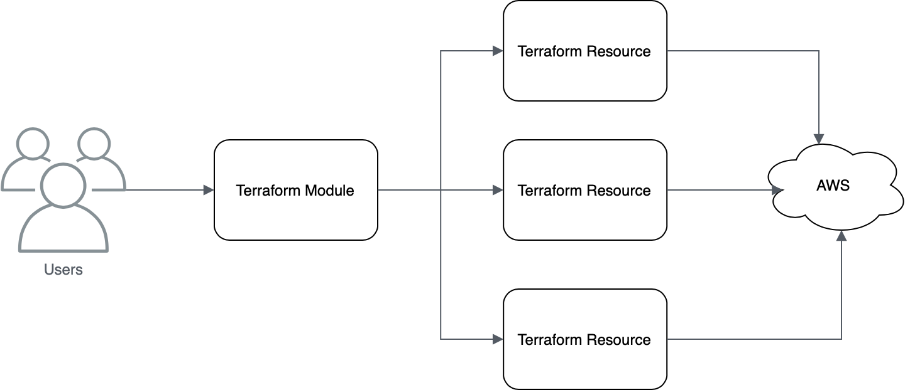
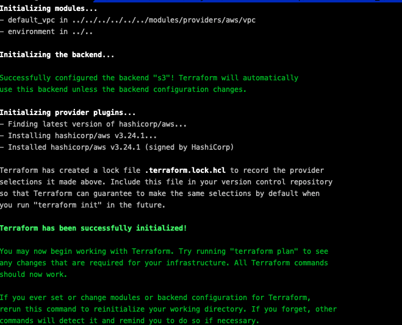
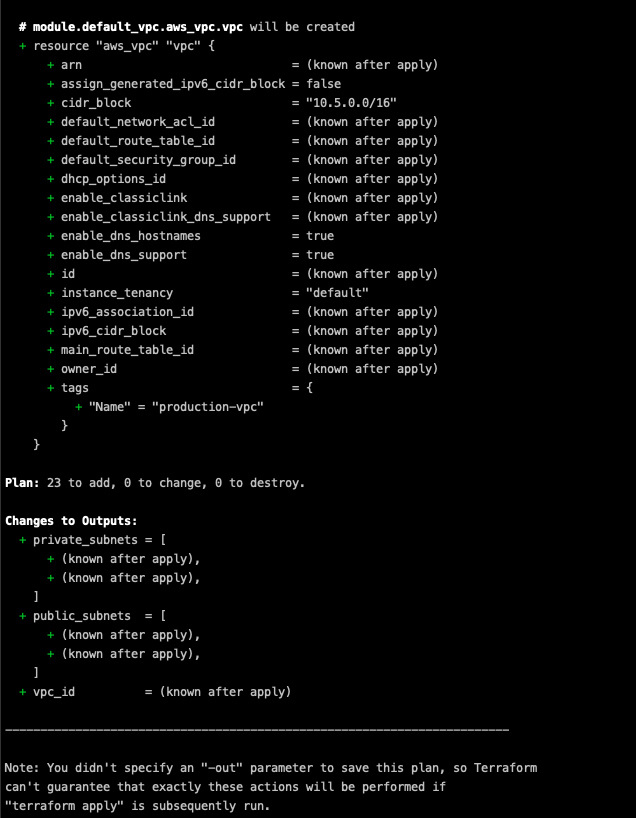
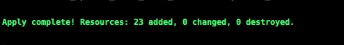
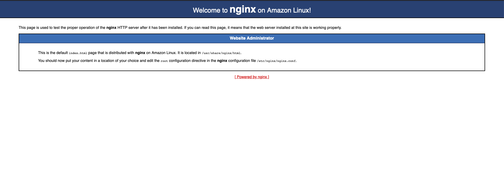
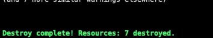

<!--
Copyright Amazon.com, Inc. or its affiliates. All Rights Reserved.

SPDX-License-Identifier: MIT-0
-->

# Terraform Sample Workshop Module 2

This module is responsible to teach you how to create modules in terraform and use them, you will learn how to create re-usable Terraform resources to improve agility when coding infraestructure.

A module is a container for multiple resources that are used together. Modules can be used to create lightweight abstractions, so that you can describe your infrastructure in terms of its architecture, rather than directly in terms of physical objects.

**Re-usable modules are defined using all of the same configuration language concepts we use in root modules**

If you need any further information, check the offical [Terraform Documentation](https://www.terraform.io/docs/modules/index.html)

# Folder Structure

```
 ── modularized_tf
    ├── environments
    │   └── providers
    │       └── aws
    │           └── prd
    │               ├── applications/
    │               ├── environment.tf
    │               └── infraestructure
    │                   └── vpc/
    └── modules
        └── providers
            └── aws
                ├── asg
                ├── elb
                ├── launch_config
                ├── security_group
                │   ├── attach_sg_ec2
                │   ├── create_sg
                │   └── create_sg_rule
                └── vpc
```

[environments](modularized_tf/environments) - This folder has the code that is responsible to call the modules, the modules together make a stack.

[modules](modularized_tf/modules) - This is the folder where the modules are stored, so inside this folder we have the Terraform Resources

Inside every module and provider environment folder, we have the same structure of files descibred in module 1:

- output.tf
- main.tf
- vars.tf
- data.tf

> If you need any information, go back to [module 1](../module_1/) and check it

# Deploying our stack in a modularized way

Now we don't have anymore one snippet that create all the AWS resources, we have a snippet that combine many modules to create AWS resources.

We also splitted the stack in two, it means, two different state files.

- The **infraestructure/** folder is where the infraestructure components will be created, components that maybe will be used for many stacks or applications, like VPC, Route 53 etc.

- The **applications/** folder is where our application stack will be created.


<p align="center"> 

</p>

## Deploying the VPC

Let's deploy first our VPC, since we need the networking components in order to create our nginx stack.

Execute:

```shell
cd modularized_tf/environments/providers/aws/prd/infraestructure/vpc
```

Now we need to change the **AWS Bucket** where out Terraform State will be saved.

Open **modularized_tf/environments/providers/aws/prd/infraestructure/vpc/main.tf** and do the follow:

```terraform
terraform {
  backend "s3" {
    region  = "us-east-1"
    bucket  = "<YOUR BUCKET NAME GOES HERE>"
    key     = "environments/providers/aws/prd/infraestructure/vpc/main.tf"
    encrypt = true
  }
}
```
> As you can see the lines of code of the file are very less from the other one, since all the complexity of resource creation is in the module layer

We are able now to init our Terraform inside our folder, for this run the follow command:

```
terraform init
```

<p align="center"> 

</p>

> It will initialize the modules

Now it's time for **terraform plan**

Execute:

```
terraform plan
```

The output will be the resources that we are going to provision or change during the terraform apply phase.

<p align="left"> 

</p>

Now let's apply our Terraform

Execute:

```
terraform apply
```

When ask to confirm if you want to apply, type **yes**

Wait some minutes to apply and the creation of resources.

<p align="left"> 

</p>

> As you can see, we've created our VPC, since VPC is a shared resource with multiple applications and stacks, we split from the web server stack.

## Deploying the Web Server Stack

Let's deploy now the web server stack that we already deployed in the last module, but now we are using the modularized way approach.

Execute:

```shell
cd modularized_tf/environments/providers/aws/prd/applications/nginx-sample-stack/
```

Now we need to change the **AWS Bucket** where out Terraform State will be saved, and also the AWS bucket where the VPC state is saved, since we are using terraform remote state approach to share states between tf stacks.

The [terraform_remote_state data source](https://www.terraform.io/docs/providers/terraform/d/remote_state.html) retrieves the root module output values from some other Terraform configuration, using the latest state snapshot from the remote backend.

This data source is built into Terraform, and is always available; you do not need to require or configure a provider in order to use it.

> In this way we don't need to pass our VPC configuration manually inside tf files.

Changing web server state:

Open **modularized_tf/environments/providers/aws/prd/prd/applications/nginx-sample-stack/main.tf** and do the follow:

```terraform
terraform {
  backend "s3" {
    region  = "us-east-1"
    bucket  = "<YOUR BUCKET NAME GOES HERE>"
    key     = "environments/providers/aws/prd/applications/nginx-sample-stack/main.tf"
    encrypt = true
  }
}
```

Changing VPC remote state data source:

Open **modularized_tf/environments/providers/aws/prd/prd/applications/nginx-sample-stack/data.tf** and do the follow:

```terraform
// Terraform remote state
data "terraform_remote_state" "vpc" {
 backend     = "s3"

 config = {
   bucket = "<YOUR BUCKET NAME GOES HERE>" // Your bucket name
   key    = "environments/providers/aws/prd/infraestructure/vpc/main.tf"
   region = "us-east-1"
 }
}
```

> As you can see it is referencing the VPC state that we created before

We are able now to init, plan and apply our Terraform inside our folder, for this run the following commands:

```
terraform init
```

```
terraform plan
```

```
terraform apply
```

Now it's time to test, wait for 2 or 3 minutes before trying to open the Load Balancer DNS generated above.

If everything works fine you will see the nginx web page.

<p align="left"> 

</p>

Now it's time to destroy our stack using **terraform destroy** command

The terraform destroy command is used to destroy the Terraform-managed infrastructure.

**DO NOT DESTROY THE VPC RESOURCES, ONLY DESTROY THE WEB SERVER STACK, WE ARE GOING TO USE THE SAME VPC IN THE NEXT MODULE**

Execute:

```
terraform destroy
```

When ask to confirm if you want to destroy, type **yes**

The Output should be the follow:

<p align="left"> 

</p>

As you can see, this command destroy all the resources that we provisioned before.


# Completion

Congratulations, you finished the second module.

[Click here to go to the next module](../module_3)


