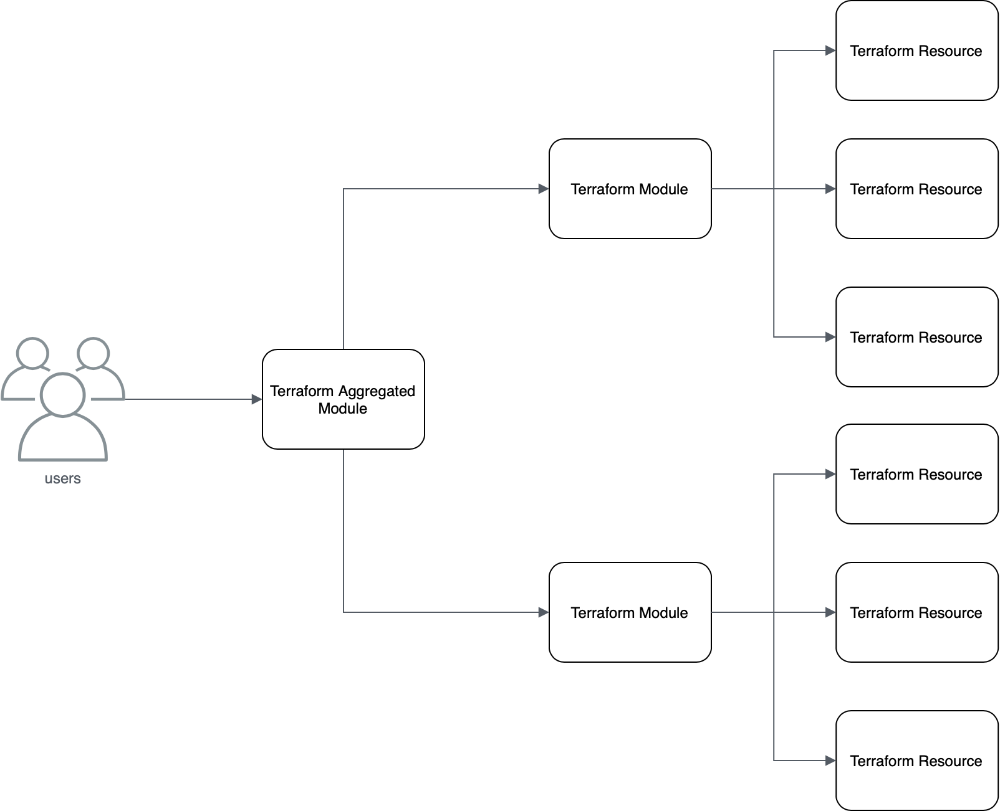

<!--
Copyright Amazon.com, Inc. or its affiliates. All Rights Reserved.

SPDX-License-Identifier: MIT-0
-->

# Terraform Sample Workshop Module 3

This module is responsible to teach you how to create other layer of abstraction, using module in module configuration, this enables you to create patterns for your stacks and write much less code reusing whats has already been written.

> A module is a container for multiple resources that are used together. Modules can be used to create lightweight abstractions, so that you can describe your infrastructure in terms of its architecture, rather than directly in terms of physical objects.

# Folder Structure

```
└── modularized_tf
    ├── base_modules
    │   └── providers
    │       └── aws
    │           ├── asg/
    │           ├── elb/
    │           ├── launch_config/
    │           ├── security_group
    │           │   ├── attach_sg_ec2/
    │           │   ├── create_sg/
    │           │   └── create_sg_rule/
    │           └── vpc
    ├── component_modules
    │   └── nginx-webserver-stack/
    └── environments
        └── providers
            └── aws
                └── prd
                    ├── applications
                    │   └── nginx-sample-stack
                    │       ├── scripts/
                    └── environment.tf
```

[environments](modularized_tf/environments) - This folder has the code that is responsible to call the modules, the modules together make a stack.

[base_modules](modularized_tf/modules) - This is the folder where the modules are stored, so inside this folder we have the Terraform Resources.

[component_modules](modularized_tf/component_modules) - This is the folder where module in module is stored, so inside this folder we have the combined modules to create our stack with patterns and pre-defined configurations.

Inside every module and provider environment folder, we have the same structure of files descibred in module 1:

- output.tf
- main.tf
- vars.tf
- data.tf

> If you need any information, go back to [module 1](../module_1/) and check it

# Deploying our stack in a module in module way

Now we don't have anymore one snippet that call the all the modules and create all the AWS resources, we have a snippet that calls a unique "big module" that combine many modules and patterns to create AWS resources.

<p align="center"> 

</p>

Open the **base_modules/** folder and check it, you will see that is much similar to the file that we used in module 2.

## Deploying the Web Server Stack

Let's deploy now the web server stack that we already deployed in the last module, but now we are using the module in module approach.

Execute:

```shell
cd modularized_tf/environments/providers/aws/prd/applications/nginx-sample-stack/
```
> Don't forget to go to the module_3 folder before running the command above

Now we need to change the **AWS Bucket** where out Terraform State will be saved, and also the AWS bucket where the VPC state is saved, since we are using terraform remote state approach to share states between tf stacks.

The [terraform_remote_state data source](https://www.terraform.io/docs/providers/terraform/d/remote_state.html) retrieves the root module output values from some other Terraform configuration, using the latest state snapshot from the remote backend.

This data source is built into Terraform, and is always available; you do not need to require or configure a provider in order to use it.

> In this way we don't need to pass our VPC configuration manually inside tf files.

Changing web server state:

Open **modularized_tf/environments/providers/aws/prd/prd/applications/nginx-sample-stack/main.tf** and do the follow:

```terraform
terraform {
  backend "s3" {
    region  = "us-east-1"
    bucket  = "<YOUR BUCKET NAME GOES HERE>"
    key     = "environments/providers/aws/prd/applications/nginx-sample-stack/main.tf"
    encrypt = true
  }
}
```

Changing VPC remote state data source:

Open **modularized_tf/environments/providers/aws/prd/prd/applications/nginx-sample-stack/data.tf** and do the follow:

```terraform
// Terraform remote statate
data "terraform_remote_state" "vpc" {
 backend     = "s3"

 config = {
   bucket = "<YOUR BUCKET NAME GOES HERE>" // Your bucket name
   key    = "environments/providers/aws/prd/infraestructure/vpc/main.tf"
   region = "us-east-1"
 }
}
```

> As you can see it is referencing the VPC state that we created in module 2

Open the [main.tf](modularized_tf/environments/providers/aws/prd/prd/applications/nginx-sample-stack/main.tf) file again, as you can see it is much smaller than the file that we used in module 2, all the complexity of patterns stays in the middle layer (Component module) and the most default resources stays in the base layer (Base modules), in this way you can create component modules from the base modules letting the base modules as default as possible.

We are able now to init, plan and apply our Terraform inside our folder, for this run the following commands:

```
terraform init
```

```
terraform plan
```

```
terraform apply
```

Now it's time to test, wait for 2 or 3 minutes before trying to open the Load Balancer DNS generated above.

If everything works fine you will see the nginx web page.

<p align="left"> 

</p>

Now it's time to destroy our stack using **terraform destroy** command

The terraform destroy command is used to destroy the Terraform-managed infrastructure.

> We will need to destroy also the VPC created in the module 2

First let's destroy the Web Server stack.

Execute:

```
terraform destroy
```

When ask to confirm if you want to destroy, type **yes**

Now go to module 2 VPC folder.

Execute:

```shell
cd ../../../../../../../../module_2/modularized_tf/environments/providers/aws/prd/infraestructure/vpc
```

And execute:

```
terraform destroy
```

When ask to confirm if you want to destroy, type **yes**.

Done!

# Workshop Completion

Congratulations, you've completed the Terraform Sample Workshop, where you learned the basics of Terraform, commands, module structure, remote state and other important things.

For further information consult the full [Terraform documentation](https://www.terraform.io/intro/index.html)